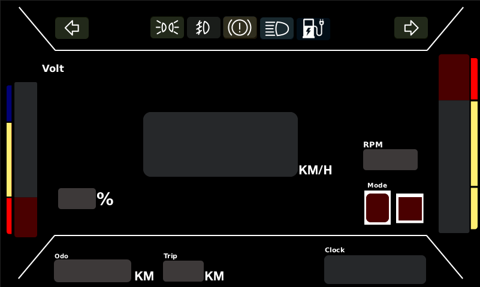
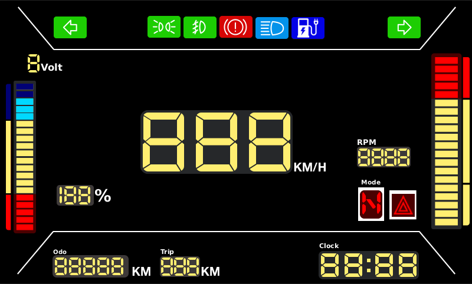
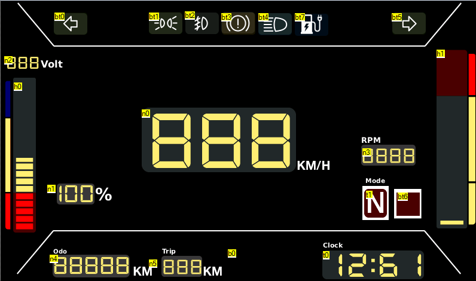

# Project_Dasboard_Nextion

## Desain Dasboard
Terdapat 2 pengerjaan utama:  
1. Mendesain tampilan menggunakan **Photopea** (Photoshop versi gratis).  
2. Mengatur konfigurasi pada **Nextion** agar mudah digunakan oleh mikrokontroler.

Teknik desain yang digunakan pada bagian visual adalah **Two-State Graphics** atau **Image Swap**.  
- Setiap elemen UI, seperti tombol atau indikator, memiliki **dua versi gambar** untuk mewakili kondisi berbeda, misalnya ON dan OFF.  
- Di Nextion, gambar ini diupload sebagai “Picture” dan bisa diganti secara otomatis menggunakan event handler, sehingga UI menjadi interaktif sesuai kondisi sensor atau kontrol mikrokontroler.

#### Pada bagian Photopea
siapkan 2 gambar mode on dan off pada dashboard.

Terlihat ini adalah gambar mode off

lalu pada Nextion gambar ini diolah dengan teknik **Two-State Graphics** atau **Image Swap**

terlihat pada Nextion seperti dibawah hasil akhirnya

telihat pada beberapa indokator dasboard dimana untuk indikator memiliki kode bx dimana pada nextion menggunakan Toolbox **dual-state button** dan pada indikator battery dan juga rpm menggunakan kode h, dimana pada toolbox nextion menggunakan **slider** disini tutorial lengkapnya dapat dilihat dari salah satu channel [Toutube]

hasil final desain berada pada file **Project_MRI_.psd**

hasil final nextion pada file **MRI_Project.HMI**